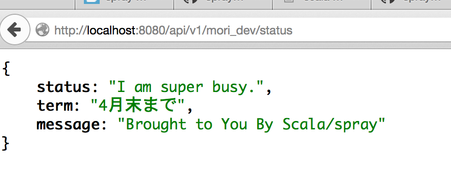

## mori_dev API を作った

https://gagnechris.wordpress.com/2013/09/15/building-restful-apis-with-scala-using-spray/ 
と https://github.com/gagnechris/SprayApiDemo を参考に何かを入力したら何かを出力する API アプリを作ろうとしたが、機能を減らしながらカスタマイズする過程で、 http://spray.io/documentation/1.2.2/spray-routing/ のもっとも単純な例にならうのがよいと気づいた。そこでまずは、普通の HTML テキストを返すようにした。次に JSON を返すようにした。
